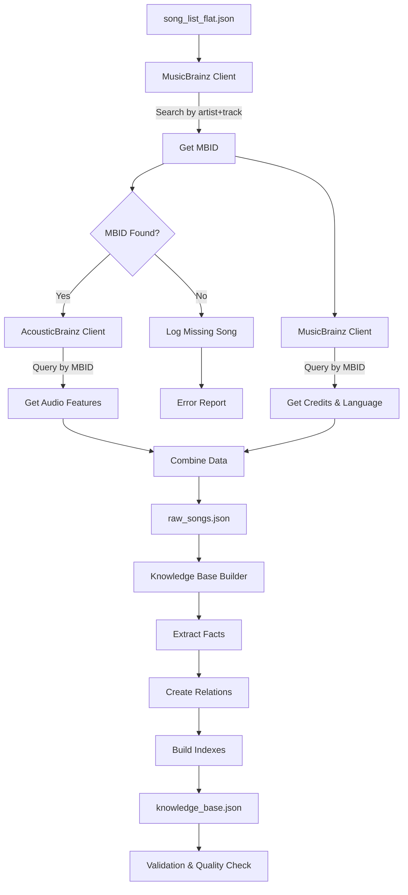

# AcousticBrainz Data Collection & Knowledge Base Construction for Module 1

## Overview

Build a complete data acquisition and knowledge base construction pipeline that:

1. Collects audio features, genre, credits, and metadata for 1,000 curated songs using AcousticBrainz (audio features + genre) and MusicBrainz (credits + language)
2. Transforms raw collected data into a structured knowledge base with facts/relations that enables efficient querying for recommendations in later modules

## Architecture



## Implementation Steps

### Phase 1: Data Collection

### 1. Create MusicBrainz API Client (`src/data_acquisition/musicbrainz_client.py`)

**Purpose**: Convert artist + track names to MBIDs and fetch recording metadata.

**Key Functions**:

- `search_recording(artist, track)` - Search MusicBrainz for a recording, return best match MBID
- `get_recording_details(mbid)` - Fetch full recording data including:
  - Artist credits (main artist + featured artists)
  - Release information
  - Language (from release/recording tags)
  - Writer credits (from recording relationships)
  - Producer credits (from recording relationships)

**API Details**:

- Base URL: `https://musicbrainz.org/ws/2/`
- Rate limit: 1 request per second (strict)
- User-Agent required (identify your application)
- No authentication needed for read-only access

**Data Structure**:

```python
{
    "mbid": "recording-mbid",
    "title": "track title",
    "artist": "main artist",
    "featured_artists": ["artist1", "artist2"],
    "writers": ["writer1", "writer2"],
    "producers": ["producer1", "producer2"],
    "language": "en"  # ISO 639-3 code or None
}
```

### 2. Create AcousticBrainz API Client (`src/data_acquisition/acousticbrainz_client.py`)

**Purpose**: Fetch audio features and genre annotations using MBIDs.

**Key Functions**:

- `get_low_level_features(mbid)` - Get low-level audio features (timbre, rhythm, tonal)
- `get_high_level_features(mbid)` - Get high-level features (mood, genre, etc.)
- `get_genre_annotations(mbid)` - Get genre tags from Last.fm annotations

**API Details**:

- Base URL: `https://acousticbrainz.org/api/v1/`
- Rate limit: More lenient than MusicBrainz, but implement delays
- No authentication needed

**Data Structure**:

```python
{
    "mbid": "recording-mbid",
    "tempo": 120.5,  # BPM
    "key": "C major",
    "mode": "major",
    "time_signature": 4,
    "loudness": -5.2,
    "duration": 240.5,
    "genres": ["rock", "pop"],  # From Last.fm annotations
    "timbre": {...},  # Low-level features
    "rhythm": {...}
}
```

### 3. Create Data Collection Orchestrator (`src/data_acquisition/collect_acousticbrainz_data.py`)

**Purpose**: Main script that coordinates data collection from both sources.

**Workflow**:

1. Load `data/song_list_flat.json`
2. For each song:

a. Search MusicBrainz for MBID (with retry logic)

b. If MBID found:

      - Query AcousticBrainz for audio features/genre (parallel or sequential)
      - Query MusicBrainz for credits/language
      - Combine data into unified structure

c. If MBID not found:

      - Log to error report
      - Continue to next song

3. Save collected data to `data/raw_songs.json`
4. Generate collection report (success rate, missing fields, etc.)

**Rate Limiting**:

- MusicBrainz: 1 request/second (strict)
- AcousticBrainz: 2 requests/second (conservative)
- Implement exponential backoff for rate limit errors

**Error Handling**:

- Handle missing MBIDs gracefully
- Handle missing AcousticBrainz data (not all songs have features)
- Handle API timeouts/errors with retries
- Track which songs failed and why

**Output Format** (`data/raw_songs.json`):

```json
[
  {
    "mbid": "recording-mbid",
    "artist": "The Beatles",
    "track": "Hey Jude",
    "decade": "1960s",
    "genre": "rock",
    "tier": "popular",
    "audio_features": {
      "tempo": 120.5,
      "key": "C major",
      "mode": "major",
      "time_signature": 4,
      "loudness": -5.2,
      "duration": 240.5
    },
    "genres": ["rock", "pop"],
    "credits": {
      "main_artist": "The Beatles",
      "featured_artists": [],
      "writers": ["Paul McCartney", "John Lennon"],
      "producers": ["George Martin"]
    },
    "language": "en",
    "collection_status": "complete"  # or "partial", "failed"
  }
]
```

### Phase 2: Knowledge Base Construction

### 4. Create Knowledge Base Builder (`src/module1/knowledge_base_builder.py`)

**Purpose**: Transform raw song data into structured knowledge base with facts/relations.

**Key Functions**:

- `load_raw_data(raw_songs_path)` - Load raw_songs.json
- `normalize_identifier(song)` - Create unique, normalized song identifier
- `extract_facts(song)` - Extract all facts from a song record
- `build_relations(song)` - Build relationship facts (produced_by, features, etc.)
- `create_indexes(facts)` - Build indexes for fast querying
- `save_knowledge_base(kb, output_path)` - Save to knowledge_base.json

**Knowledge Base Structure**:

The knowledge base should support efficient querying for Module 3 (Search). Recommended structure:

**Option A: Indexed Facts Dictionary** (Recommended for simplicity and speed)

```python
{
    "songs": {
        "hey_jude_beatles": {
            "mbid": "recording-mbid",
            "artist": "The Beatles",
            "track": "Hey Jude",
            "decade": "1960s",
            "tier": "popular"
        }
    },
    "facts": {
        "has_tempo": {
            "hey_jude_beatles": 120.5,
            "come_together_beatles": 125.0
        },
        "has_genre": {
            "hey_jude_beatles": ["rock", "pop"],
            "come_together_beatles": ["rock"]
        },
        "produced_by": {
            "hey_jude_beatles": ["george_martin"],
            "come_together_beatles": ["george_martin"]
        },
        "written_by": {
            "hey_jude_beatles": ["paul_mccartney", "john_lennon"]
        },
        "performed_by": {
            "hey_jude_beatles": ["the_beatles"]
        },
        "features": {
            "song_with_feature": ["featured_artist"]
        },
        "has_language": {
            "hey_jude_beatles": "en"
        }
    },
    "indexes": {
        "by_tempo_range": {
            "100-110": ["song1", "song2"],
            "110-120": ["song3"],
            "120-130": ["hey_jude_beatles", "come_together_beatles"]
        },
        "by_genre": {
            "rock": ["hey_jude_beatles", "come_together_beatles"],
            "pop": ["hey_jude_beatles"]
        },
        "by_producer": {
            "george_martin": ["hey_jude_beatles", "come_together_beatles"]
        },
        "by_artist": {
            "the_beatles": ["hey_jude_beatles", "come_together_beatles"]
        }
    }
}
```

**Option B: Graph Structure** (More complex, better for relationship traversal)

- Nodes: Songs, Artists, Producers, Writers, Genres
- Edges: Relationships (produced_by, written_by, has_genre, etc.)
- Use networkx or similar library

**Fact Extraction Logic**:

```python
def extract_facts(song):
    facts = []
    song_id = normalize_identifier(song)
    
    # Audio feature facts
    if song.get("audio_features", {}).get("tempo"):
        facts.append(("has_tempo", song_id, song["audio_features"]["tempo"]))
    if song.get("audio_features", {}).get("key"):
        facts.append(("has_key", song_id, song["audio_features"]["key"]))
    if song.get("audio_features", {}).get("mode"):
        facts.append(("has_mode", song_id, song["audio_features"]["mode"]))
    
    # Genre facts
    for genre in song.get("genres", []):
        facts.append(("has_genre", song_id, normalize_genre(genre)))
    
    # Credit facts
    if song.get("credits", {}).get("main_artist"):
        facts.append(("performed_by", song_id, normalize_artist(song["credits"]["main_artist"])))
    for producer in song.get("credits", {}).get("producers", []):
        facts.append(("produced_by", song_id, normalize_artist(producer)))
    for writer in song.get("credits", {}).get("writers", []):
        facts.append(("written_by", song_id, normalize_artist(writer)))
    for featured in song.get("credits", {}).get("featured_artists", []):
        facts.append(("features", song_id, normalize_artist(featured)))
    
    # Language fact
    if song.get("language"):
        facts.append(("has_language", song_id, song["language"]))
    
    return facts
```

**Query Support Functions**:

The knowledge base should provide helper functions for Module 3:

```python
def get_tempo(song_id, kb):
    return kb["facts"]["has_tempo"].get(song_id)

def get_genres(song_id, kb):
    return kb["facts"]["has_genre"].get(song_id, [])

def songs_by_tempo_range(min_tempo, max_tempo, kb):
    # Use tempo index for fast lookup
    matching_songs = []
    for song_id, tempo in kb["facts"]["has_tempo"].items():
        if min_tempo <= tempo <= max_tempo:
            matching_songs.append(song_id)
    return matching_songs

def songs_by_genre(genre, kb):
    return kb["indexes"]["by_genre"].get(genre, [])

def songs_by_producer(producer, kb):
    return kb["indexes"]["by_producer"].get(normalize_artist(producer), [])

def shares_producer(song1_id, song2_id, kb):
    producers1 = set(kb["facts"]["produced_by"].get(song1_id, []))
    producers2 = set(kb["facts"]["produced_by"].get(song2_id, []))
    return len(producers1 & producers2) > 0
```

### 5. Create Knowledge Base Module (`src/module1/__init__.py` and `src/module1/knowledge_base.py`)

**Purpose**: Provide a clean interface for other modules to query the knowledge base.

**Key Classes/Functions**:

```python
class KnowledgeBase:
    def __init__(self, kb_path):
        self.data = self._load(kb_path)
    
    def get_song(self, song_id):
        """Get song metadata"""
        return self.data["songs"].get(song_id)
    
    def get_tempo(self, song_id):
        """Get tempo for a song"""
        return self.data["facts"]["has_tempo"].get(song_id)
    
    def get_genres(self, song_id):
        """Get genres for a song"""
        return self.data["facts"]["has_genre"].get(song_id, [])
    
    def get_producers(self, song_id):
        """Get producers for a song"""
        return self.data["facts"]["produced_by"].get(song_id, [])
    
    def find_similar_by_tempo(self, query_tempo, tolerance=5):
        """Find songs with similar tempo"""
        min_tempo = query_tempo - tolerance
        max_tempo = query_tempo + tolerance
        return self._songs_by_tempo_range(min_tempo, max_tempo)
    
    def find_by_genre(self, genre):
        """Find all songs in a genre"""
        return self.data["indexes"]["by_genre"].get(genre, [])
    
    def find_by_producer(self, producer):
        """Find all songs by a producer"""
        normalized = self._normalize_artist(producer)
        return self.data["indexes"]["by_producer"].get(normalized, [])
    
    def all_songs(self):
        """Get all song IDs"""
        return list(self.data["songs"].keys())
```

### 6. Add Validation & Quality Checks

**Validation Functions**:

- `validate_completeness(kb)` - Check what percentage of songs have each field
- `validate_consistency(kb)` - Check for duplicate songs, inconsistent data
- `validate_queryability(kb)` - Test that indexes work correctly
- `generate_quality_report(kb)` - Report statistics on data coverage

**Quality Metrics**:

- Songs with complete audio features: X%
- Songs with genre data: X%
- Songs with credit information: X%
- Songs with language: X%
- Average facts per song: X

### 7. Update Dependencies (`requirements.txt`)

Add:

- `musicbrainzngs>=0.7.1` - Official MusicBrainz Python library (handles rate limiting)
- Keep `requests>=2.31.0` for AcousticBrainz API calls
- Optional: `networkx>=3.0` if using graph structure for knowledge base

### 8. Create Configuration (`src/data_acquisition/config.py` or `.env`)

**Settings**:

- MusicBrainz user-agent (required)
- Rate limit delays
- Retry attempts
- Batch size for processing
- Output file paths
- Knowledge base structure type (indexed vs graph)

### 9. Add Progress Tracking & Logging

**Features**:

- Progress bar (using `tqdm` if desired)
- Detailed logging to file
- Resume capability (checkpoint which songs have been processed)
- Collection statistics report
- Knowledge base construction statistics

## Data Completeness Strategy

Since not all songs will have complete data:

- **Priority**: Get MBID first (required for both APIs)
- **Fallback**: If AcousticBrainz data missing, still include MusicBrainz metadata
- **Marking**: Use `collection_status` field to indicate completeness
- **Knowledge Base**: Only include facts for fields that exist (don't create null facts)
- **Module 1**: Will need to handle partial data gracefully

## Reliability for Recommendations

The knowledge base structure ensures reliability for later modules:

1. **Fast Querying**: Indexes enable O(1) or O(log n) lookups by tempo, genre, producer, etc.
2. **Relationship Traversal**: Can find songs connected by shared producers, writers, featured artists
3. **Multi-Criteria Search**: Module 3 can efficiently combine multiple criteria (tempo + genre + producer)
4. **Completeness Tracking**: Know which songs have which data, handle missing gracefully
5. **Normalized Identifiers**: Consistent song/artist/producer IDs enable accurate matching

## Testing Approach

1. **Unit Tests**: Test each client independently with known MBIDs
2. **Integration Tests**: Test full pipeline with small subset (10-20 songs)
3. **Error Cases**: Test with invalid artist/track names, missing MBIDs
4. **Rate Limiting**: Verify delays are working correctly
5. **Knowledge Base Tests**: Test fact extraction, indexing, and query functions
6. **Query Performance**: Verify indexes provide fast lookups

## Files to Create

1. `src/data_acquisition/musicbrainz_client.py` - MusicBrainz API client
2. `src/data_acquisition/acousticbrainz_client.py` - AcousticBrainz API client  
3. `src/data_acquisition/collect_acousticbrainz_data.py` - Main collection script
4. `src/data_acquisition/config.py` - Configuration settings
5. `src/data_acquisition/__init__.py` - Package initialization
6. `src/module1/knowledge_base_builder.py` - Knowledge base construction
7. `src/module1/knowledge_base.py` - Knowledge base query interface
8. `src/module1/__init__.py` - Module 1 package initialization
9. Update `requirements.txt` - Add `musicbrainzngs`

## Estimated Collection Time

- MusicBrainz: 1,000 songs × 1 sec = ~17 minutes (just for MBID lookup)
- AcousticBrainz: 1,000 songs × 0.5 sec = ~8 minutes
- MusicBrainz details: 1,000 songs × 1 sec = ~17 minutes
- **Total Collection**: ~42 minutes minimum (plus retries/errors)
- **Knowledge Base Construction**: ~1-2 minutes for 1,000 songs

Recommend running in batches or with resume capability for production use.