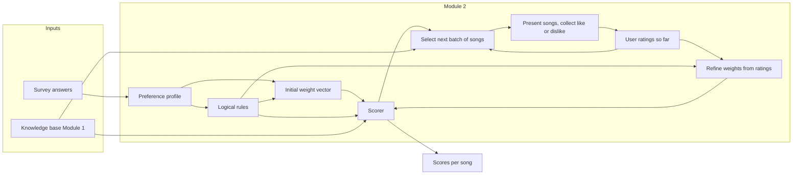

# Module 2: Rule-Based Preference System (Survey + Song Ratings)

## Goal

Deliver a **rule-based preference system** (logical rules + weight vectors) that scores songs using the existing knowledge base. Input is **(1) survey answers** and **(2) user like/dislike on a personalized, adaptively chosen sample of songs** from the KB. The like/dislike phase uses **hill-climbing-style active learning**: the next songs shown depend on the current preference model and prior ratings, and each response refines the weights so the model moves toward the user's true preference. The refined weights (and optionally similarity to liked songs) drive scoring. Module 3 will consume this system to rank candidates.

## Current Foundation

- **Knowledge base** (`[src/knowledge_base_wrapper.py](src/knowledge_base_wrapper.py)`): exposes `get_fact(fact_type, mbid)`, `songs_by_*`, `songs_in_loudness_range`, and indexes for `has_genre`, `has_loudness`, `has_danceable`, `has_voice_instrumental`, `has_timbre`, `has_mood`.
- **Facts** (from `[unit_tests/fixtures/test_knowledge_base.json](unit_tests/fixtures/test_knowledge_base.json)`): genre (list), loudness (float), danceable (categorical), voice_instrumental (categorical), timbre (categorical), mood (list).
- **Demo preview** (`[presentation/queries.py](presentation/queries.py)` `demo_3_rule_based_preferences`): illustrates IF genre AND danceable AND mood style rules; no scoring yet.

## 1. Survey Design (Questions → KB Features)

Define a small **survey schema**: each question id, prompt text, type (multi-choice / range / multi-select), and mapping to KB fact(s) and value(s).

**Suggested questions (align with KB facts):**

| Survey question / concept        | KB fact(s)               | Allowed values / range          |
| -------------------------------- | ------------------------ | ------------------------------- |
| Preferred genres (multi-select)  | `has_genre`              | from `kb.get_all_genres()`      |
| Preferred mood(s) (multi-select) | `has_mood`               | from `kb.get_all_moods()`       |
| Danceability                     | `has_danceable`          | danceable / not_danceable / any |
| Voice vs instrumental            | `has_voice_instrumental` | voice / instrumental / any      |
| Timbre                           | `has_timbre`             | bright / dark / any             |
| Loudness range                   | `has_loudness`           | min_db, max_db (e.g. -15 to -5) |

Survey **output**: a single structured object (e.g. dict or dataclass) holding user choices (e.g. `preferred_genres: List[str]`, `preferred_moods: List[str]`, `danceable: str`, `voice_instrumental: str`, `timbre: str`, `loudness_min: float`, `loudness_max: float`). This is the **preference profile** input to the rule/weight system.

**Implementation note:** Survey can be implemented as (a) a static config (e.g. JSON or Python dict) that defines questions and allowed values, plus (b) a function or small script that collects answers (CLI prompts or later a simple UI) and returns the preference profile. For checkpoint, CLI or hardcoded profile is enough; no need for a full web survey.

## 2. Song Sampling and User Ratings (Post-Survey): Hill-Climbing-Style Active Learning

After the user completes the initial survey, the **like/dislike section** uses a **hill-climbing-like active learning** strategy: maintain a single current preference model (rules + weights), update it from each user response, and choose the **next** songs to show based on the current model so that feedback is informative and the model moves toward the user's true preference.

**Loop (repeat until enough ratings or user stops):**

1. **Select next songs**: Using the **current** rules + weights (and optionally ratings so far), choose a small batch of songs (e.g. 3–5) to show. Strategy:
   - **Exploit**: Include some songs the current model scores highly (personalized to current estimate).
   - **Explore / active learning**: Include songs near the **decision boundary** (scores in a middle band, e.g. neither clearly liked nor disliked by the model) so that like/dislike gives maximum information, or songs that differ from already-rated ones on one or two features to probe the preference surface.
2. **Present the batch**: Show each song's artist and track (and optionally a few KB facts). User responds with **like** or **dislike** (and optionally skip/neutral).
3. **Update the model (hill-climbing step)**: Refine the weight vector from the new ratings (e.g. increase weights for rules that liked songs satisfy, decrease for rules that disliked songs satisfy). This is the "move" in preference space toward the user's likes and away from dislikes.
4. **Repeat**: With the updated weights, select the next batch and continue.

**Concrete choices:**

- **First batch**: Use initial survey-based rules + equal (or survey-derived) weights; select e.g. top-K by score (personalized) or stratified across genres/moods so the first responses are informative.
- **Subsequent batches**: Use the **refined** weights. Next-song policy examples: (a) score all unrated songs with current scorer, pick a mix of high-scoring (exploit) and mid-scoring / boundary (explore) songs; (b) prefer songs that are "one feature different" from a liked song to test that dimension. Exclude already-rated mbids.
- **Rating scheme**: Like / dislike (binary) is enough for weight refinement; optional neutral/skip. Store as `(mbid, rating)` with rating e.g. 1 (dislike), 2 (neutral), 3 (like) for numeric refinement.
- **Persistence**: Keep ratings in memory for the session; optionally save/load (e.g. JSON) so the same user can reuse them without re-rating.

This yields a **rated song list** and a **refined weight vector** that have been updated in a hill-climbing manner: each step uses feedback to move the single preference model toward the user's revealed preferences.

## 3. Data Model: Preference Profile, Rules, Weight Vector, Ratings

- **Preference profile**: holds raw survey answers (preferred genres, moods, danceable, voice_instrumental, timbre, loudness range). Stored as a single object (e.g. `PreferenceProfile` dataclass or typed dict).
- **Logical rules**: each rule is a **condition** over KB facts plus an optional **label/priority**. Prefer a simple, evaluatable representation, e.g.:
  - **Condition**: "genre in preferred_genres", "mood in preferred_moods", "danceable == preference", "voice_instrumental == preference", "timbre == preference", "loudness in [min, max]".
  - Stored as a list of rule objects (e.g. `Rule(condition_type, fact_type, target_value(s))`) or equivalent dicts.
- **Weight vector**: one weight per rule or per **feature dimension** (e.g. `genre_weight`, `mood_weight`, `danceable_weight`, …). Non-negative floats; can be normalized to sum to 1 or left as-is and used in a weighted sum. Stored as a dict mapping rule id or feature name to float.

**Build step:** From a **preference profile** (survey answers), the system **builds** the set of logical rules and an **initial** weight vector (e.g. equal weights).

- **User ratings**: A list (or dict) of `(mbid, rating)` for the sampled songs. Ratings are used to **refine the weight vector** (see below) and optionally to add a "similarity to highly-rated songs" term to the score.

**Incorporating ratings into the preference system (rule-based, no ML):**

- **Weight refinement**: For each rated song, compute which rules it satisfies (using the KB). Then:
  - **High-rated songs**: Increase the weights of the rules they satisfy (e.g. small positive delta or multiplicative boost), so that future songs satisfying those rules score higher.
  - **Low-rated songs**: Decrease the weights of the rules they satisfy (or increase weights of rules they *don't* satisfy), so that songs like them score lower.
  - Implementation: one pass over rated songs; for each rule, compute average rating of songs that satisfy it vs. don't; adjust that rule's weight accordingly (e.g. rule weight += alpha * (avg_rating_satisfied - avg_rating_overall)). Keep weights non-negative (e.g. clamp or use a small floor).
- **Optional similarity term**: Add a second component to the score: for each candidate song, compute a "similarity to highly-rated songs" (e.g. fraction of shared genre/mood, or inverse distance in loudness). Blend with the rule-based score: `final_score = (1 - beta) * rule_score + beta * similarity_to_rated`. This stays rule-based if similarity is defined only on KB features (no learned embeddings). For minimal scope, weight refinement alone is enough; similarity can be added if time permits.

## 4. Rule Evaluation and Scoring

- **Rule evaluation**: For a given song (mbid) and KB, evaluate each rule (true/false or partial score). Use existing `KnowledgeBase` API: `get_fact`, `songs_by_*`, `songs_in_loudness_range`. For "genre in preferred", check intersection of song's `has_genre` with profile's preferred genres; for "mood in preferred", same with `has_mood`. For numeric loudness, check if song's loudness is in [min, max].
- **Scoring**: Combine rule outcomes with the weight vector. Simple approach: **weighted sum** of rule scores (e.g. 1.0 if rule satisfied, 0.0 otherwise). Optional: partial scores for genre/mood (e.g. fraction of preferred genres that match). Output a single **score** per song (float).
- **API**: One clear entry point for Module 3, e.g.  
`score(song_mbid: str, kb: KnowledgeBase) -> float`  
and optionally  
`score_all(song_mbids: List[str], kb: KnowledgeBase) -> List[Tuple[str, float]]`  
or a method on a `PreferenceSystem` / `RuleBasedScorer` class that holds the profile, rules, weights, and (optionally) the refined weights after applying ratings.

## 5. Code Layout

- **New package under `src/`**: e.g. `src/preferences/` (or `src/rule_based_preferences/`).
  - `survey.py` (or `survey_schema.py`): survey question definitions and allowed values; function to build a `PreferenceProfile` from answers (e.g. from dict or CLI).
  - `profile.py`: `PreferenceProfile` (survey answers) and possibly validation (e.g. loudness_min <= loudness_max, allowed categories).
  - `rules.py`: rule representation (condition types, target values) and **building** rules from a `PreferenceProfile` (e.g. one rule per feature: genre match, mood match, danceable match, etc.).
  - `weights.py` or inside `rules.py`: weight vector definition and default weights (equal or configurable).
  - `scorer.py`: class that holds rules + weights (refined by ratings if provided), takes KB in constructor or `score(song_mbid, kb)`, and returns float; optionally `score_all` for batch.
  - `sampling.py`: (1) Initial batch: select N songs for the first like/dislike round (e.g. top-K by initial score or stratified). (2) **Adaptive (hill-climbing) batch**: given KB, current scorer (rules + weights), and ratings-so-far, select the *next* N songs (e.g. mix of high-score and boundary/mid-score, excluding already-rated). Returns list of mbids.
  - `ratings.py`: data structure for user ratings `(mbid, rating)`; function to apply ratings to refine the weight vector (given KB, rules, current weights, and ratings list). Used after each batch (or after each single rating) in the active-learning loop.
- **Dependency**: This module **depends only on** the KB interface (`KnowledgeBase` from `src/knowledge_base_wrapper.py`). No dependency on Module 3 or 4.
- **Entry point / demo**: A script that (1) loads KB, (2) runs survey (or loads hardcoded profile), (3) builds initial rules + weights, (4) runs the **hill-climbing like/dislike loop**: repeatedly select next batch (adaptive sampling), present songs, collect like/dislike, refine weights, then select next batch until done, (5) runs scorer on a few songs and prints scores. This demonstrates: survey → adaptive like/dislike (active learning) → refined rule-based scoring.

## 6. Flow Diagram

## 7. Testing

- **Unit tests** (in `unit_tests/preferences/`, mirroring `src/preferences/`):
  - **Profile**: build profile from dict; validation (e.g. loudness range, allowed categories).
  - **Rules**: build rules from a profile; rule structure matches expected condition types.
  - **Weights**: default weight vector; optional custom weights.
  - **Scorer**: with a **fixture KB** (reuse or copy from `unit_tests/fixtures/test_knowledge_base.json`), create a small profile + rules + weights, then assert that:
    - A song that matches all rules gets a higher score than one that matches none.
    - A song that matches genre but not mood gets a score between those two (if weights are positive).
    - Edge cases: song missing a fact (e.g. no mood) → rule for mood yields 0 or "no match"; scorer does not crash.
  - **Sampling**: (1) Initial batch: given KB and optional scorer, get N distinct mbids. (2) Adaptive batch: given KB, current scorer, and list of already-rated mbids, next batch excludes those and returns e.g. mix of high-score and boundary songs; assert batch size and no duplicates with already-rated.
  - **Ratings and weight refinement**: with fixture KB and a small ratings list (e.g. high rating for a song that satisfies "genre=rock", low for one that doesn't), apply refinement and assert that the "genre" rule weight increases (or that after refinement, a rock song scores higher than before).
- **Integration test** (in `integration_tests/module_2/`): load real or fixture KB, (1) build profile from survey-like input, (2) build rules and initial weights, (3) run a short **hill-climbing loop**: get initial batch, apply mock like/dislike, refine weights, get next batch (adaptive), apply mock ratings again, refine, (4) run scorer on multiple songs. Assert that (mbid, score) ordering is sensible and that songs similar to liked ones rank higher after refinement; optionally assert that the second batch differs from the first (e.g. includes boundary or different mix).

## 8. README and AGENTS.md

- **README.md**: Add/update Module 2 row in the module plan table (inputs: KB + survey answers + user ratings on sampled songs; outputs: rule-based preference system = logical rules + weight vectors refined by ratings + scorer). Reference `src/preferences/` and tests.
- **AGENTS.md**: Copy updated module plan; note that Module 2 is "Rule-Based Preference Encoding (survey + song ratings)" and that Module 3 will use the scorer.

## 9. Out of Scope for This Plan

- Playlist-based preference input (deferred to Module 4).
- ML-based learning or tuning (Module 4); weight refinement here is a simple rule-based update from ratings (e.g. average rating per rule).
- Search implementation (Module 3); only the **scoring API** that Module 3 will call needs to be defined and tested.

## Summary of Deliverables

| Deliverable        | Description                                                                |
| ------------------ | -------------------------------------------------------------------------- |
| Survey schema      | Questions and mapping to KB facts; way to produce a preference profile.    |
| Preference profile | Data structure for survey answers.                                         |
| Song sampling      | Initial batch (e.g. top-K or stratified); **adaptive batch** (next N given current scorer + ratings) for hill-climbing like/dislike. |
| User ratings       | Data structure and collection for (mbid, like/dislike); optional save/load. |
| Active-learning loop | Hill-climbing: select batch → present → like/dislike → refine weights → repeat; next batch uses updated weights and excludes already-rated. |
| Logical rules      | Representation and construction from profile; evaluatable against KB.     |
| Weight vector      | Initial (from survey) and refined (from ratings); per-rule or per-feature. |
| Weight refinement  | Update weights using which rules each rated song satisfies and its rating. |
| Scorer             | `score(mbid, kb) -> float` (and optionally batch) using refined weights.   |
| Unit tests         | Profile, rules, weights, sampling, refinement, scorer with fixture KB.     |
| Integration test   | End-to-end: survey → profile → rules → sample → ratings → refine → scores. |
| Demo               | Script: survey (or hardcoded profile) → sample → ratings → refined scores. |
| Docs               | README/AGENTS.md module spec and layout.                                   |
