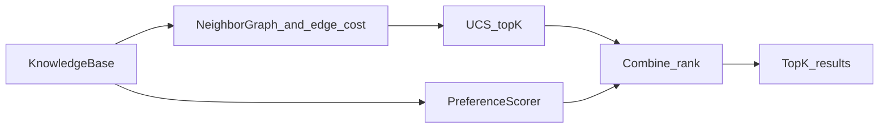

# Module 3: Search Over Knowledge Base

## Requirements (from [MODULES.md](MODULES.md))

- **Topic:** Search (UCS, A*, Beam, etc.) with explicit state-space formulation and path cost design.
- **Inputs:** Knowledge base (Module 1), rule-based preferences from Module 2, query song(s) or preference profile.
- **Outputs:** Ranked top-K similar songs with similarity scores (path cost and/or combined score).
- **Constraints:** Avoid popularity bias—ranking must not use play counts or popularity; treat songs uniformly in the search space (only KB facts + preference model).
- **Downstream:** Results feed Module 5 (clustering); document a clear API for that.

## Current repository state (relevant)

- `**[src/knowledge_base_wrapper.py](src/knowledge_base_wrapper.py)`:** `KnowledgeBase` loads `songs`, `facts`, `indexes`; provides `get_all_songs()`, `get_fact()`, genre/mood/danceable/timbre/loudness helpers. No graph structure yet.
- `**[src/preferences/scorer.py](src/preferences/scorer.py)`:** `PreferenceScorer.score(mbid, kb)`—weighted rule satisfaction. Use this to **re-rank** or **combine** with search results, not as a substitute for a real search algorithm on the rubric.
- `**[src/preferences/sampling.py](src/preferences/sampling.py)`:** Random/score-based sampling for ratings—different problem from Module 3 retrieval.
- **Tests:** Module 2 has `[integration_tests/module_2/test_module2_integration.py](integration_tests/module_2/test_module2_integration.py)`; there is **no** `src/search/` (or equivalent) yet.
- `**[presentation/queries.py](presentation/queries.py)`:** `demo_2_search_queries` previews index-based queries; Module 3 should go beyond set intersection to **explicit search** with costs and a documented formulation.

## Proposed state space and graph

**States:** Song MBIDs in the KB.

**Neighbors:** Generate successors from shared structure in the KB (no popularity):

- Union songs that share at least one **genre** or **mood** with the current song (via `indexes`), optionally add same **danceable** / **voice_instrumental** / **timbre** bucket neighbors.
- **Cap** fan-out (e.g., top `M` neighbors by incremental cost) so UCS stays tractable on large KBs.

**Edge cost (non-negative):** Transition cost from song `u` to `v` should reflect **feature dissimilarity**, aligned with facts you already store (see [data/README.md](data/README.md)):

- Numeric: e.g. `|loudness_u - loudness_v|`, `|duration_u - duration_v|` (scale with constants).
- Categorical / sets: penalty if no genre overlap, no mood overlap; smaller penalty for partial overlap.
- **Optional later:** If the KB gains `writers` / `producers` / `featured_artists` as facts, add a **negative** cost component (reward) for shared collaborators—keep behind a feature flag or `if fact present` so tests still run on the current fixture.

**Query modes:**

1. **Primary (required for checkpoint clarity):** Single **query MBID** (seed song)—run search from this node.
2. **Profile-only query:** If no seed song, define a deterministic strategy (e.g., run multi-source UCS from all MBIDs that satisfy a coarse filter from `PreferenceProfile`, or beam-expand from index unions)—**decide one** and document it; simplest is to require a seed MBID for v1 and add profile-only as stretch.

**Combining search with Module 2:**

- Compute **path cost** `C(v)` from start to `v` (UCS).
- Compute **preference score** `P(v) = PreferenceScorer.score(v, kb)`.
- Export **final ranking** with a documented combination, e.g. `score = -α * C_norm + β * P_norm` (min-max normalize per query) or sort primarily by `C`, break ties with `P`. Document constants and normalization in code comments or a small dataclass result type.

## Algorithms to implement

| Algorithm                     | Role                                                                                                                                                                                                                  |
| ----------------------------- | --------------------------------------------------------------------------------------------------------------------------------------------------------------------------------------------------------------------- |
| **Uniform Cost Search (UCS)** | **Primary:** Optimal for non-negative edge costs; pop states in order of cumulative cost; collect **first K expansions** (or first K distinct settled nodes excluding the start) as “nearest” under the graph metric. |
| **Beam Search**               | **Optional second:** Same neighbor policy, fixed beam width—useful for narrative (“exploring locally”) and complexity discussion; good for large KBs if UCS is too heavy.                                             |
| **A***                        | **Optional:** Admissible heuristic e.g. **distance-to-query** lower bound using only per-node features (never use popularity). Only add if time; UCS alone satisfies the module topic if clearly documented.          |

**Popularity:** Do not read or add popularity fields to cost or heuristic; if `knowledge_base.json` ever includes them, ignore for Module 3.

## Suggested package layout

- New package: `[src/search/](src/search/)` (or `src/similarity_search/` if you prefer clarity vs Python’s `search` builtin—if naming collision matters, use `song_search`).
  - `graph.py` – build neighbor lists from `KnowledgeBase` + edge cost function.
  - `costs.py` – pure functions: dissimilarity between two songs given KB facts.
  - `ucs.py` – UCS with visited set, stopping rule for top-K.
  - `beam.py` – optional beam search.
  - `pipeline.py` – public API: `find_similar(kb, query_mbid, scorer, k, **opts) -> list[SearchResult]`.
- **Types:** Small `NamedTuple` or dataclass for `SearchResult(mbid, path_cost, preference_score, combined_score)`.

## Testing

- `**unit_tests/search/`** (mirror `src/search/`): Edge costs (symmetry optional—document if directed), UCS on **tiny hand-built graphs** (mock KB or minimal JSON), tie-breaking determinism, K behavior, empty/singleton KB.
- `**integration_tests/module_3/`:** Load `[unit_tests/fixtures/test_knowledge_base.json](unit_tests/fixtures/test_knowledge_base.json)` (same pattern as Module 2), build a real `PreferenceScorer` from a `PreferenceProfile`, assert returned list length ≤ K, start node excluded, ordering respects combined rule; optionally assert a song that is “closer” in feature space ranks above a distant one under fixed costs.

## Docs and project hygiene

- Update **[README.md](README.md)** module table row for Module 3 (inputs/outputs/paths) when you implement—per your repo workflow.
- Update **[AGENTS.md](AGENTS.md)** with Module 3 path and dependency on Module 2 scorer.
- Optional: add a one-line demo hook in `[presentation/queries.py](presentation/queries.py)` or a small `python -m` entry showing UCS top-K (only if you want demo parity with Module 2 preview).

## Complexity and risks

- **Branching factor:** Must cap neighbors and/or use beam for production-sized KB.
- **Metric vs. rules:** Keep a clear story: UCS minimizes **graph path cost**; `PreferenceScorer` encodes **user** fit—both are required for the “search + preferences” story in MODULES.md.

## Mermaid: data flow

## Implementation order

1. `costs.py` + unit tests (pairwise dissimilarity).
2. `graph.py` (neighbors + optional cap) + tests.
3. `ucs.py` + tests (toy graphs + fixture KB).
4. `pipeline.py` integrating `PreferenceScorer` + normalization.
5. Optional `beam.py` + integration test comparison.
6. README/AGENTS updates and rubric pass via `[.claude/skills/code-review/SKILL.md](.claude/skills/code-review/SKILL.md)`.

