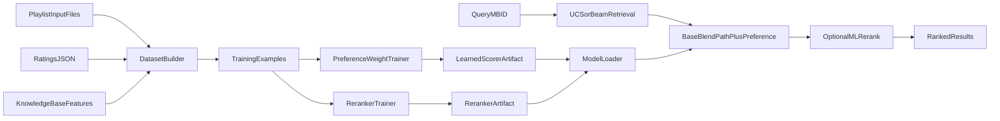

# Module 4 Implementation Plan

## Goal

Implement Module 4 as a **train-once, reuse-model** supervised-learning layer that:

- learns from playlists + ratings offline
- improves Module 2-style preference scoring
- optionally reranks Module 3 results at inference
- never reads raw playlist files during normal recommendation calls

## Scope and Constraints

- Recommendation runtime stays fast and deterministic (`find_similar` should not trigger training).
- Existing Module 2 and Module 3 behavior must remain backward compatible by default.
- ML components are optional hooks: if model artifacts are missing, system falls back to current rule/search behavior.
- Inputs for this module are limited to KB-derived song features, playlists, and ratings (no external live services).

## Baseline to Build On

- Module 2 has stable scoring contracts in [`/Users/eleanorbadgett/343-projects/project-2-ai-system-badgett-sledge-ftw/src/preferences`](/Users/eleanorbadgett/343-projects/project-2-ai-system-badgett-sledge-ftw/src/preferences).
- Module 3 has stable retrieval/blend contracts in [`/Users/eleanorbadgett/343-projects/project-2-ai-system-badgett-sledge-ftw/src/search/pipeline.py`](/Users/eleanorbadgett/343-projects/project-2-ai-system-badgett-sledge-ftw/src/search/pipeline.py).
- Existing tests in [`/Users/eleanorbadgett/343-projects/project-2-ai-system-badgett-sledge-ftw/unit_tests/preferences`](/Users/eleanorbadgett/343-projects/project-2-ai-system-badgett-sledge-ftw/unit_tests/preferences), [`/Users/eleanorbadgett/343-projects/project-2-ai-system-badgett-sledge-ftw/unit_tests/search`](/Users/eleanorbadgett/343-projects/project-2-ai-system-badgett-sledge-ftw/unit_tests/search), and [`/Users/eleanorbadgett/343-projects/project-2-ai-system-badgett-sledge-ftw/integration_tests/module_3`](/Users/eleanorbadgett/343-projects/project-2-ai-system-badgett-sledge-ftw/integration_tests/module_3) define current expected behavior.

## End-to-End Data Flow

## Implementation Phases

### Phase 1: Define Data Contracts and Files

- Add playlist input format docs and parser assumptions (expected MBID lists per playlist).
- Standardize training inputs:
  - playlists file(s): positive examples
  - `data/user_ratings.json`: explicit label signal
  - KB facts/features: model features
- Define artifact schema and locations under [`/Users/eleanorbadgett/343-projects/project-2-ai-system-badgett-sledge-ftw/data`](/Users/eleanorbadgett/343-projects/project-2-ai-system-badgett-sledge-ftw/data), including version metadata and training timestamp.
- Deliverable: clear I/O spec so training and inference use identical schemas.

### Phase 2: Build Module 4 Package (`src/ml`)

- Create [`/Users/eleanorbadgett/343-projects/project-2-ai-system-badgett-sledge-ftw/src/ml`](/Users/eleanorbadgett/343-projects/project-2-ai-system-badgett-sledge-ftw/src/ml) with:
  - dataset builder (`dataset.py`): merges playlists + ratings + KB features into supervised rows
  - learned scorer (`learned_scorer.py`): outputs score-compatible signal for Module 2 integration
  - reranker (`reranker.py`): predicts per-candidate relevance for second-stage ordering
  - artifact I/O (`artifacts.py`): save/load utilities with schema checks
- Keep APIs small and typed so tests can stub models deterministically.
- Deliverable: model-independent module surface that can be trained/loaded reliably.

### Phase 3: Training Pipeline (Offline Only)

- Add a reproducible training entrypoint (e.g., `train_module4.py`) that:
  - loads playlist and rating inputs
  - builds dataset with deterministic seed
  - fits scorer model and reranker model
  - evaluates basic metrics (accuracy/ranking sanity, not heavy benchmarking)
  - saves artifacts to fixed paths
- Add explicit retraining command for manual refresh only.
- Deliverable: one command that produces artifacts for inference; no online retraining path.

### Phase 4: Inference Integration

- Scorer integration:
  - use `LearnedPreferenceScorer` to wrap the existing `PreferenceScorer` so it still exposes `score(mbid, kb)` for Modules 2–3.
  - compute learned feature score from Module 4 weights and combine it with the rule-based score via a blend weight λ.
  - provide a helper (`build_scorer_with_optional_ml`) that:
    - checks for `data/module4_scorer.json`
    - loads it if present and valid
    - returns either the wrapped learned scorer or the original `PreferenceScorer` as a safe fallback.
- Search integration:
  - keep `find_similar` signature unchanged; it only requires an object with `score(mbid, kb)`.
  - allow callers (demos, CLIs, tests) to opt into ML-enhanced scoring by passing a `LearnedPreferenceScorer` instead of a plain `PreferenceScorer`.
  - preserve exact legacy behavior when reranker is `None`
  - ensure deterministic ordering with tie-break rules
- Deliverable: hybrid behavior available via optional flags while default path remains stable.

### Phase 5: Validation and Hardening

- Add guardrails:
  - missing artifact fallback to baseline rules/search
  - invalid playlist MBIDs skipped with warnings
  - schema mismatch raises clear errors
- Ensure no regressions in Module 2/3 test expectations.
- Deliverable: robust failure handling and backward compatibility.

## Testing Plan

### Unit Tests

- `unit_tests/ml/test_dataset.py`:
  - positive/negative label generation correctness
  - deterministic sampling and reproducible splits
  - feature extraction from KB edge cases
- `unit_tests/ml/test_learned_scorer.py`:
  - fit/predict sanity on fixture data
  - score range and deterministic output checks
  - artifact roundtrip compatibility
- `unit_tests/ml/test_reranker.py`:
  - candidate ordering behavior
  - no-op behavior when reranker disabled

### Existing Test Extensions

- Update [`/Users/eleanorbadgett/343-projects/project-2-ai-system-badgett-sledge-ftw/unit_tests/search/test_pipeline.py`](/Users/eleanorbadgett/343-projects/project-2-ai-system-badgett-sledge-ftw/unit_tests/search/test_pipeline.py):
  - legacy output unchanged without ML reranker
  - reranked output deterministic when ML reranker provided
- Update/add preferences tests to verify learned scorer compatibility with current interfaces.

### Integration Tests

- Add [`/Users/eleanorbadgett/343-projects/project-2-ai-system-badgett-sledge-ftw/integration_tests/module_4`](/Users/eleanorbadgett/343-projects/project-2-ai-system-badgett-sledge-ftw/integration_tests/module_4):
  - train -> save -> load -> recommend end-to-end path
  - confirms raw playlists are only read in training stage
  - verifies hybrid effect (learned scorer + reranker can change rank order)

## Milestone Checklist

- Milestone 1: Data contract + artifact paths finalized.
- Milestone 2: `src/ml` core components implemented with unit tests.
- Milestone 3: Offline training command works and saves artifacts.
- Milestone 4: Optional inference integration in `find_similar` complete.
- Milestone 5: Module 4 integration tests pass and Module 2/3 regressions are clear.

## Documentation and Submission Readiness

- Update [`/Users/eleanorbadgett/343-projects/project-2-ai-system-badgett-sledge-ftw/README.md`](/Users/eleanorbadgett/343-projects/project-2-ai-system-badgett-sledge-ftw/README.md) Module 4 section with:
  - required input files
  - training command
  - inference usage
  - test commands
- Add `MODULE4_PLAN.md` and checkpoint 4 report scaffold with evidence fields (design choices, trade-offs, test results).
- Run final rubric-focused review using [`/Users/eleanorbadgett/343-projects/project-2-ai-system-badgett-sledge-ftw/.claude/skills/code-review/SKILL.md`](/Users/eleanorbadgett/343-projects/project-2-ai-system-badgett-sledge-ftw/.claude/skills/code-review/SKILL.md).

